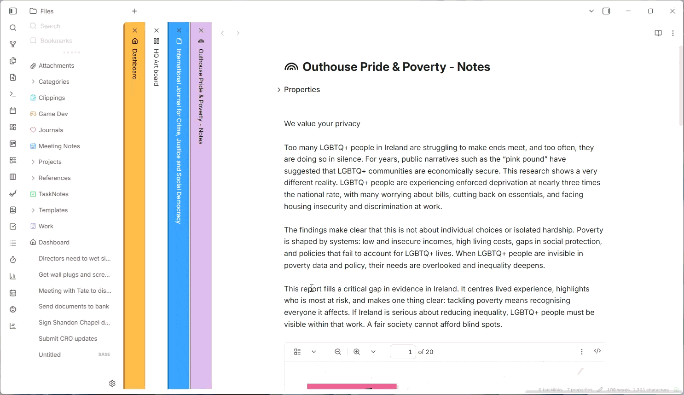
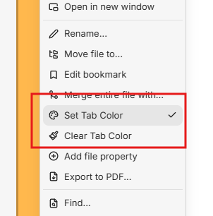
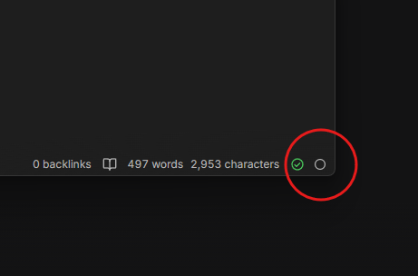

# Tab Colors



Tab Colors adds custom colors to Obsidian tabs, with optional auto-color rules and note background effects.

## What It Does

- Set or clear a color from a tab right-click menu.
- Save manual colors per note and keep them on rename/move.
- Auto-apply colors by tag or folder rule.
- Auto-apply a color from frontmatter (configurable key).
- Support horizontal, vertical, and stacked tab layouts.
- Keep text/icons readable with automatic contrast.
- Add optional note effects: none, gradient, or dots.
- Status bar dot shows the active note's color — click it to open the color picker.

Rule priority:
1. Manual tab color
2. Frontmatter color - for example: tabColor: "#3aa6ff"
3. Tag rule
4. Folder rule



## Install (Manual)

1. Download this repo (or a release zip).
2. Build:

```bash
npm.cmd install
npm.cmd run build
```

3. Copy these files to .obsidian/plugins/tab-colors/ in your vault:
- manifest.json
- main.js
- styles.css
4. Enable Tab Colors in Obsidian: Settings -> Community plugins.

## Quick Use

1. Right-click a tab.
2. Select Set Tab Color.
3. Choose a preset or custom color.
4. To remove a color, select Clear Tab Color.



The **status bar dot** (bottom of the window) shows the active note's color at a glance. Click it to open the color picker directly.

## Settings

In Settings -> Community plugins -> Tab Colors:

- Preset swatches: rename, recolor, add, or reset presets.
- Frontmatter auto colors: set the frontmatter key (default: tabColor).
- Tag auto colors: map tags (for example #project) to colors.
- Folder auto colors: map folder paths (for example Journal) to colors.
- Accessibility mode: auto-pick best tab text color and warn on low-contrast tab colors.
- Minimum contrast ratio: set the warning threshold (used by Accessibility mode).
- Note blend:
  - Effect: None, Gradient, or Dotted pattern
  - Blend intensity: 0-100%
  - Gradient length: 80-600px
  - Dot size: 1-8px
  - Dot spacing: 6-40px
  - Dot intensity: 0-100%

Frontmatter example:

```yaml
---
tabColor: "#3aa6ff"
---
```

Only 3-digit or 6-digit hex values are used from frontmatter.

## Development

```bash
npm.cmd install
npm.cmd run dev
```

Production build:

```bash
npm.cmd run build
```
