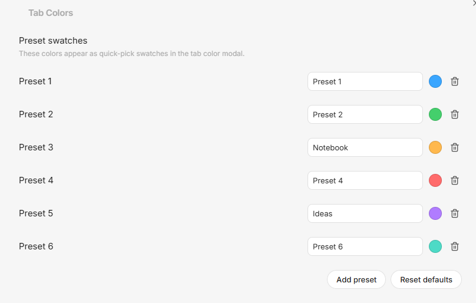
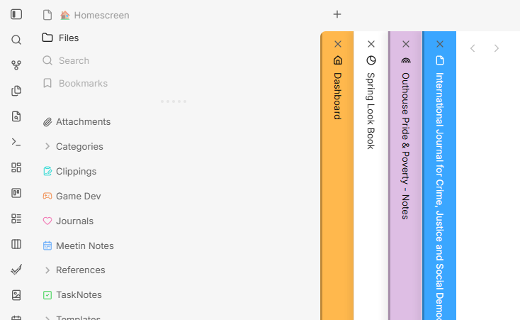

# Tab Colors

Tab Colors lets you right-click a tab in Obsidian and give it a custom color.

This is my first Obsidian plugin, and honestly, it started as a personal "I really wish this existed" project. I have wanted tab colors in Obsidian for a long time.

The idea was inspired by the Firefox extension Adaptive Tab Bar Colour (https://addons.mozilla.org/en-US/firefox/addon/adaptive-tab-bar-colour/), but I wanted something more like OneNote where I can choose my own colors for tabs.

I am still learning, so please be kind. If you spot rough edges or have ideas, feel free to modify, extend, and improve this project.

## Highlights

- Right-click any tab to assign a custom color to that file.
- Remove a tab color instantly with Clear Tab Color in the same menu.
- Save colors per file path so your tab colors stay consistent across sessions.
- Support both horizontal and vertical tab layouts.
- Apply full-tab background color (not just the text area).
- Automatically choose a contrasting text/icon color for readability.
- Create and manage named presets in plugin settings for faster color picking.






## Installation (Manual)

1. Download this repository (or a release zip).
2. Build the plugin:

```bash
npm.cmd install
npm.cmd run build
```

3. Copy these files into your vault plugin folder at `.obsidian/plugins/tab-colors/`:
	- `manifest.json`
	- `main.js`
	- `styles.css`
4. In Obsidian, open Settings -> Community plugins and enable Tab Colors.

## Usage

1. Right-click a tab.
2. Select Set Tab Color.
3. Pick a color (or click a named preset).
4. To remove a color, right-click the tab and select Clear Tab Color.

## Configure Named Presets

1. Open Settings -> Community plugins -> Tab Colors.
2. In Preset swatches, set each preset Name and Color.
3. Optional: add more presets or reset to defaults.

## Development

```bash
npm.cmd install
npm.cmd run dev
```

Production build:

```bash
npm.cmd run build
```
